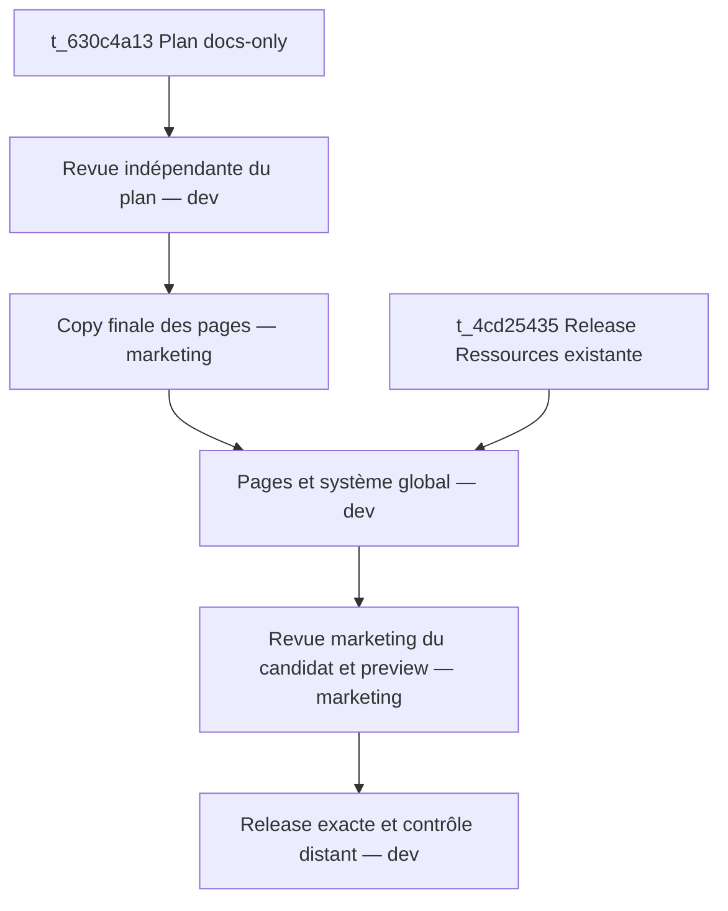

# Roadmap d’exécution

15/09/2026. Plan de t_630c4a13. Les IDs réels sont conservés dans EXECUTION-CARDS.json. Les cinq cartes de production vivent dans des worktrees absolus de memlia-landing, profils dev/marketing existants sans override modèle. Notifications marketing prescrites mais NON CONFIGURÉES à la clôture du plan : API refusée par le contexte d’exécution. Le correctif opérationnel borné est confié au profil existant default via t_5463cd1a. Aucun contournement ni nouveau profil ni cron.

## Graphe minimal

La revue de copy par dev est intégrée à BUILD avant code ; la revue du code et des promesses par marketing à QA avant release. Ne pas doubler cette chaîne avec une same-card review. Si le reviewer trouve un défaut, la dépendance n’est pas déclarée satisfaite : correction ciblée puis recontrôle de la même preuve. Utiliser le cycle de revue du board ou une carte de correction explicitement reliée sans contourner les parents.

## Lots, contrats et hotspots
| Lot | Entrées | Sorties | Propriétaire / vérification |
|---|---|---|---|
| Revue plan | Commit docs exact + preuves | Verdict sur inventaire, périmètre, compatibilité Ressources | dev ; rejouer validate-plan.py, contrôler sources et routes |
| Copy | Plan relu | docs/strategy/site-v2/copy/ : cinq pages complètes, Blog et blocs ; matrice claims | marketing ; chaque section a utilité, preuve ou limite et CTA ; aucune mutation src |
| Implémentation | Copy acceptée + release Ressources achevée | Gabarits/pages/navigation/schema/maillage/tests + preview | dev seul propriétaire Nav/Footer/Base/site.mjs/tokens ; build/check/test et oracle |
| QA | Commit et preview exacts | Verdict indépendant, captures, promesses, SEO, responsive | marketing ; six largeurs, JS off, hashes et mutant/oracle ; pas de retouches concurrentes |
| Release | QA acceptée + candidat inchangé | Production vérifiée + notification preuves/rollback | dev ; état source/déploiement, routes, assets, robots, sitemap, rollback exact |

hotspot: src/components/Nav.astro, src/components/Footer.astro, src/layouts/Base.astro, src/data/site.mjs, src/styles/tokens.css — partagés avec Ressources ; un seul lot code après sa release. Si le chemin tokens a changé, relever le nouveau chemin au lieu de créer un fichier parallèle.

## Règle de branche et transfert
Ce plan est un commit local docs-only sur wt/t_630c4a13, sans push. Chaque enfant lit son SHA dans le handoff et récupère explicitement ce commit dans son worktree (cherry-pick docs ou intégration locale contrôlée). Ne pas présumer que les fichiers non poussés sont dans main. La copy produit un commit docs-only à son tour. BUILD se base sur le commit de production issu de Ressources et intègre ensuite seulement les commits docs/copy ; ne fusionne jamais un WIP Ressources.

Les branches de code et preview utilisent site/<sujet>. Le projet Cloudflare s’appelle memlia, pas memlia-landing. Preview avec noindex/nofollow, URL immutable et identité du candidat. Seule RELEASE peut pousser/merger main et publier dans ce graphe, après les parents. La règle d’autonomie autorise la publication vérifiée ; notifier après avec preuve et commande de retour arrière. Aucun email prospect.

## Budget et arrêt
Revue : une session, 60 tours/2 h ; copy : une session, 100 tours/3 h ; implémentation : 160 tours/4 h ; QA : 100 tours/3 h ; release : 80 tours/2 h. Reprises bornées à deux corrections sur un même contrôle avant diagnostic d’entrée/escalade documentée. Pas de nouveau modèle parce que « tâche importante ».

Absence de GSC/CrUX/SERP = ND et non blocage. Absence de release Ressources = dépendance réelle, exprimée par l’arête. Accès à Cloudflare manquant = capability ; conserver candidat et preuves. Un score Lighthouse insuffisant n’est pas transformé en PASS : corriger puis mesurer, ou rendre un échec motivé. Toute carte doit clôturer avec transition structurée et preuves, pas une promesse en prose.

## Définition du fini de la campagne
Les cinq pages et l’écosystème éditorial cohérent sont visibles en production ; aucune URL historique cassée, aucune orpheline, aucun noindex accidentel, zéro promesse non étayée, auteur exact, navigation mobile visible, performance testée et rollback possible. Le plan seul ne remplit pas cette définition ; sa clôture libère précisément les phases nécessaires.
