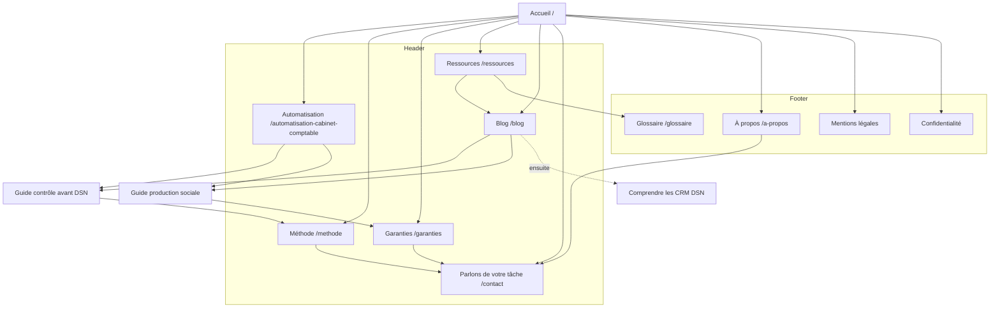

# Architecture de site — v2

15/09/2026. Décisions D01–D15 ; inventaire complet dans PAGE-INVENTORY.md, données dans page-inventory.json.

## Arbre L0–L3
```text
/ — proposition globale et orientation (L0)
├── /automatisation-cabinet-comptable — service sur mesure (L1, nouveau)
├── /methode — déroulement et preuve de la démarche (L1, nouveau)
├── /garanties — contrôle, données, limites (L1, nouveau)
├── /a-propos — fondateur, rôle et responsabilité (L1, nouveau)
├── /contact — préparer le premier échange (L1, nouveau)
├── /blog — méthodes expliquées (L1, conservé)
│   ├── /blog/controler-les-bulletins-de-paie-avant-la-dsn (L2, conservé)
│   ├── /blog/suivre-la-production-sociale-dans-excel (L2, conservé)
│   └── /blog/comprendre-les-comptes-rendus-metier-dsn (L2, ensuite conditionnel)
├── /ressources — orientation par tâche puis format (L1, autre chaîne)
├── /glossaire — définitions (L1, autre chaîne ; enfants selon son manifeste)
├── /mentions-legales — noindex (L1, conservé)
└── /politique-de-confidentialite — noindex (L1, conservé)
```
Aucun L3 nécessaire dans le lot actuel. Les détails de glossaire appartiennent à sa chaîne : reprendre leurs URL exactes depuis le manifeste de release, pas les recréer. /guides et /modeles sont des namespaces conditionnels du chantier Ressources, pas des pages vides de cette v2.

## Sitemap visuel et zones de navigation


## Navigation précise
Desktop : logo → / ; Automatisation → /automatisation-cabinet-comptable ; Méthode → /methode ; Garanties → /garanties ; Ressources → /ressources ; Blog → /blog ; bouton « Parlons de votre tâche » → /contact. Six entrées hors logo. Pas de dropdown nécessaire. Le CTA de contenu conserve « Identifier une tâche à automatiser » ; libellé court de navigation différent, action et destination identiques.

Mobile : logo puis navigation visible dans le flux, deux colonnes de liens et CTA pleine largeur. Pas de hamburger requis, pas de carrousel horizontal de liens ni d’onglets défilants ; accepter la hauteur nécessaire. À 320 px, une colonne si le texte ne tient pas, jamais réduire les cibles. Chaque cible ≥48 px de haut, espacement interne défini, focus visible. Ne pas fixer tout le panneau au scroll s’il masque le contenu ; le laisser défiler. Ordre DOM = ordre visuel. aria-current=page. Bouton menu éventuel seulement pour destinations secondaires, aucune entrée primaire cachée.

Footer :
- Le service : Automatisation, Méthode, Garanties, Contact.
- Pour travailler : Ressources, Blog, Glossaire lorsque publié.
- Memlia : À propos, Mentions légales, Confidentialité ; email public existant, aucun téléphone/TVA.
Pas de répétition de toutes les ancres de la landing. Un paragraphe : « L’IA prépare le travail répétitif. Votre cabinet garde la décision. »

## Breadcrumbs et URL
Français, minuscules, tirets, pas de slash final sauf /. Accueil > Blog > titre pour les articles. Accueil > Méthode, Accueil > Automatisation, etc. Glossaire à la racine : Accueil > Glossaire > terme, et non Ressources comme faux parent URL. Ressources est un hub de découverte transversal, pas un dossier URL.

Conserver les articles, /blog et les légales exactement. Conserver /#usages, /#methode, /#integration, /#garanties, /#questions et /#preuves : les ancres existantes restent utiles pour les liens historiques, elles ne déclenchent pas de redirection serveur. Les résumés de la landing renvoient aux pages détaillées.

Redirections : aucune migration éditoriale dans ce lot. Si slash final est reçu, un seul 301/308 vers canonical selon comportement Cloudflare vérifié. Pour une vraie suppression ultérieure, 301 seulement vers contenu équivalent, sinon 404/410 réel ; jamais toutes les erreurs → /. Ne pas créer d’alias /services ou /solutions en doublon. Sitemap XML exclut noindex, routes futures, redirections et fichiers de preuve privés.

## Distinction accueil/service
Accueil : qui, quel problème, promesse bornée, aperçu de la méthode, orientation vers guides et contact. Service : quelles tâches qualifier, exemples de livrables, dépendances outils, exclusions, critères du devis et de la recette. Pas de duplication du même hero, des mêmes paragraphes et FAQ. Faute de différence réelle à la revue, fusionner la proposition service avant développement plutôt que publier une page creuse.

## Intégration Ressources
t_4cd25435 doit être terminé avant tout code global. Lire le manifeste courant, préserver les URLs et le contenu métier livrés. Aucun nouveau worker du présent plan ne possède /ressources, /glossaire, /guides ou /modeles. Il ne possède que leur place dans Nav/Footer et les liens transversaux, après relecture de la source de vérité. L’inventaire de cette carte n’est pas un ordre de remplacement de leur manifeste.
